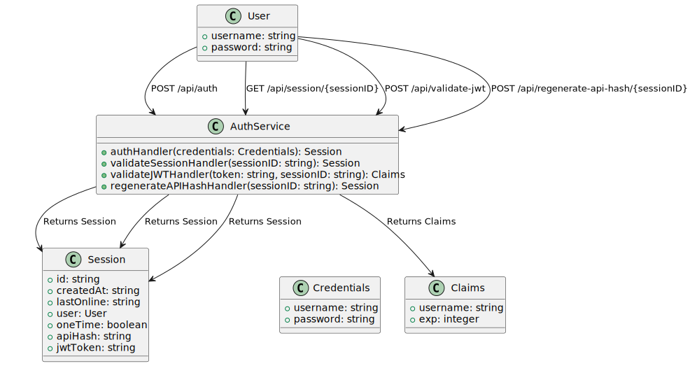

# AsykyAuthService

AsykyAuthService - простой микросервис на Go для аутентификации пользователей и управления сессиями. 
Поддерживает:
- аутентификацию
- проверку JWT
- валидацию сессий и пересоздание API-хэша.

## Описание маршрутов



### `/api/auth` [POST]

Принимает имя пользователя и хеш-пароль, возвращает JSON сессии.

**Пример запроса:**

```sh
curl -X POST -H "Content-Type: application/json" -d '{"username":"JohnDoe","password":"5f4dcc3b5aa765d61d8327deb882cf99"}' http://localhost:8080/api/auth
```

### `/api/session/{sessionID}` [GET]

Валидирует сессию по ее идентификатору.

**Пример запроса:**

```sh
curl -X GET http://localhost:8080/api/session/{sessionID}
```

### `/api/validate-jwt` [POST]

Валидирует JWT токен.

**Пример запроса:**

```sh
curl -X POST -H "Authorization: {JWT_TOKEN}" -H "Session-ID: {sessionID}" http://localhost:8080/api/validate-jwt
```

### `/api/regenerate-api-hash/{sessionID}` [POST]

Пересоздает API-хэш для указанной сессии.

**Пример запроса:**

```sh
curl -X POST http://localhost:8080/api/regenerate-api-hash/{sessionID}
```

## Установка

1. Убедитесь, что у вас установлен Go (версия 1.16 или выше). Если Go еще не установлен, скачайте и установите его с [официального сайта Go](https://golang.org/dl/).

2. Склонируйте репозиторий.

3. Инициализируйте проект и установите зависимости:

   ```sh
   go mod init AsykyAuthService
   go mod tidy
   ```

4. Создайте файл `.env` в корне вашего проекта и добавьте туда параметры:

   ```plaintext
   PORT=8080
   JWT_SECRET=my_secret_key
   ID_SIZE=12
   ```

## Запуск

Запустите ваш проект, выполнив команду:

```sh
go run main.go
```

Сервер будет запущен на порту, указанном в файле `.env`.

## Примеры запросов

### Аутентификация

```sh
curl -X POST -H "Content-Type: application/json" -d '{"username":"JohnDoe","password":"5f4dcc3b5aa765d61d8327deb882cf99"}' http://localhost:8080/api/auth
```

### Валидация сессии

```sh
curl -X GET http://localhost:8080/api/session/{sessionID}
```

### Валидация JWT

```sh
curl -X POST -H "Authorization: {JWT_TOKEN}" -H "Session-ID: {sessionID}" http://localhost:8080/api/validate-jwt
```

### Пересоздание API-хэша

```sh
curl -X POST http://localhost:8080/api/regenerate-api-hash/{sessionID}
```